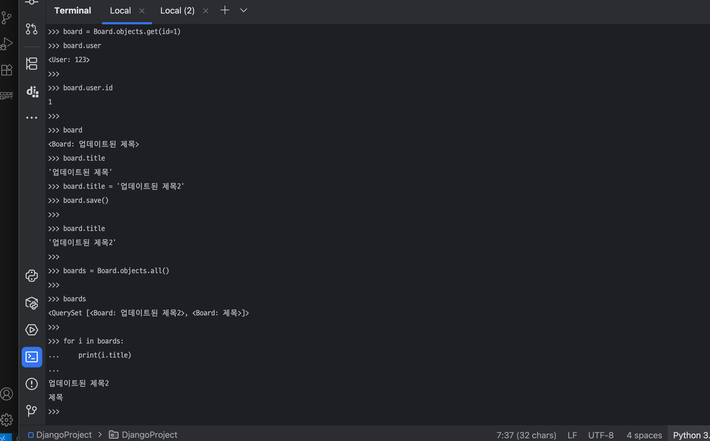

# Django_11

## Django 순서별 정리

1. 가상환경 세팅
pycham이나 vscode로 들어가서 프로젝트 파일생성

터미널에서 가상환경 세팅

python3.13 -m venv .venv

가상환경 파일이 생성됨

생성 된 가상환경 활성화 하는 명령어

source venv/bin/activate

2. 프로젝트 생성 순서

pip install django

django-admin startproject 파일이름 -> 기본적으로 config로 사용됨

3. 프로그램에 필요한 기능들을 앱으로만들어서 관리 -> 앱 생성

명령어 -> django-admin startapp 앱 이름 

생성된 앱의 기능을 views에서 정의함 

4. model 정의 -> 앱의 model 작성 -> model=table

모들은 테이블이라고 생각하면 됨

class User():
    pass

5. makemigtions, migrate

1.python manage.py makegrations
마이그레이션 파일이 생성됨

2.python manage.py migrate
생성된 마이그레이션을 실제 DB에 저장

6. 관리자 페이지 설정

관리자 페이지 생성
python manage.py createsuperuser
아이디와 비밀번호 설정하면 만들어짐

접속 방법
python manage.py runserver 
위 명령어로 접속 가능

관리자 페이지 관리
users->admin 
위 파일에서
@admin.register(User)
class UserAdmin(admin.ModelAdmin)
    pass

위 형식처럼 작성하면 기능을 구현할수 있음

7. 기능 구현

각 앱마다 기능을 구현할수있는데 User에서 필요한 기능을 Users/views에서 정의함
users/views

class Users(APIView)
    def post(self, request)

    password = request.data.get('password')

위 형식으로 작성해서 기능을 추가할수 있음

8. url 경로 설정

프로젝트 파일 생성하면 config라는 파일의 urls파일 
urlpatterns 안에 형식에 맞게 url을 등록할수 있음 
url마다 함수를 호출해서 url경로로 가면 그 기능이 작동됨

예시)
    path('admin/', admin.site.urls)

9. 서버 실행 및 기능 확인

python manage.py runserver
파일실행 후 접속
url설정한 기능 접속해보고 확인

Django 각 파일의 역할

config/
settings -> 전역 설정 -> 프로젝트 설정파일(DB연결, 정적파일, 앱 등록 등)
urls -> url경로 지정 앱생성시마다 등록해줘야함

users/
models -> table
admin -> 관리자 페이지 설정
views -> 기능구현

ORM 
DB에 있는 데이터들을 객체처럼 사용할수 있게 해주는 방식

ORM 실습 사진

